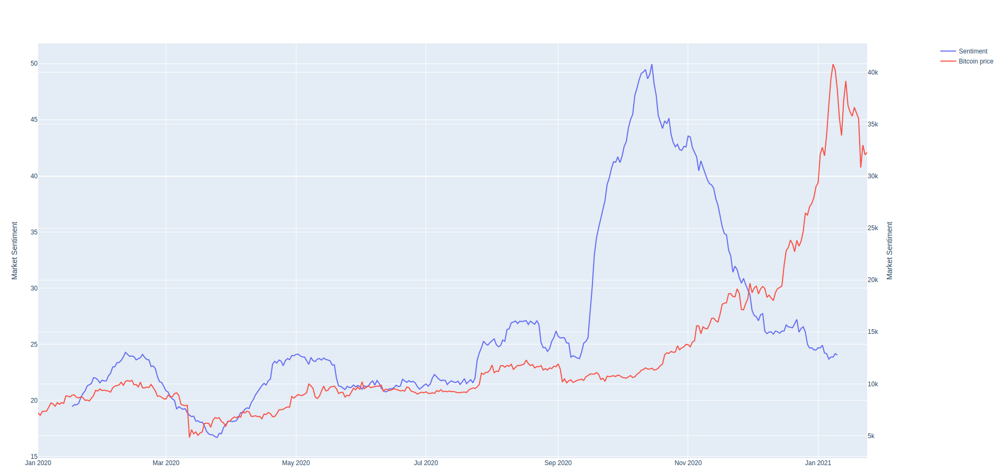
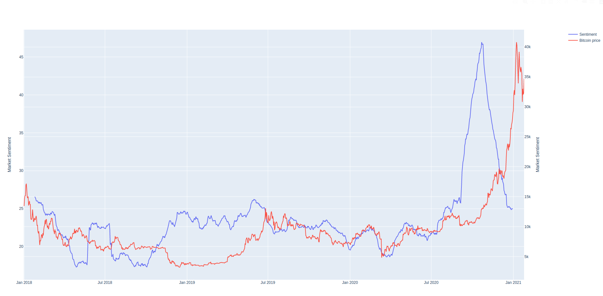

# Bitcoin Sentiment analysis

## Steps:

**You can directly go to STEP 2 if you want to use our tweets dataset.**

**1 ) run getTweetsKeyWord.py**
You might want to modify the parameters.
To do so, you have to modify the inputs of the function getTweetsSnscrape in the main.
The syntax is the following: 

*getTweetsSnscrape(year,month,day,nbrOfDysToScrape,nbrOfTweetsPerDay, oufputFileName, KeyWord)*

Tweets must be cleaned/preprocessed. The file preprocessingTweets.py contains functions that we use to clean the tweets. By "clean" we mean removing emojis, strange characters, links etc...

**2) run drawMovingAverage.py**

A menu will appear, select 1, 2 or 0.

Input 1 to compute the sentiment on the tweets. the first input of the function is the path of the tweets dataset and the second input is the path of the output file. If you want to modify these parameters go to the *Menu()* function and find the first if. It calls the function *GetSentiment(inputFileName, outputFileName)*. 

Input 2 if you want to display the chart. It plots bitcoin's price next to the sentiment moving average. You might need to modify the paths of the files. You can also modify the window of the moving average. See part "Analysis" for more details.

Press 0 to EXIT

## Analysis

We use a moving average to smoothen the curve. The smallest it is the more noise you will have.

According to us, the 2 configurations that are the most relevant are:

**1)     window = 30, from 2020**

Modify the sentiment dataset file name (sentimentHashtagBitcoin.csv) & set the btcusd display range from 2020-01-01 to 2021-01-24.

 CreationChart(df1, btcusd['2020-01-01':'2021-01-24'])

**2 )     window = 50, from 2018 to 2020**  

CreationChart(df1, btcusd['2018-01-01':])

We can observe that the sentiment follows the price approximately well. When a huge price movement happens the sentiment anticipates it. For example the sentiment increased a lot before the pump of december 2020. It might be interesting to compute the sentiment for a bigger period, from 2015 for example. 

### TEST on top 100 influencers:

We tried to compute the sentiment only using top 100 crypto influencers' tweets. The result was quite disappointing. Files are in the folder "*top100crypto*"

The file getTwitterHandles.py allows us the scrap the data from the website https://cryptoweekly.co/100/ so that we can get the top 100 crypto influencers. They potentially have a bigger influence on the price.

